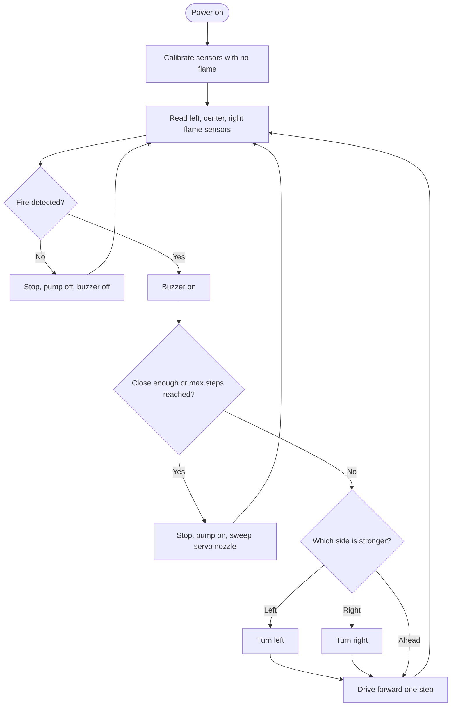

# Flowchart

```mermaid
flowchart TD
    A([Power on]) --> B[Calibrate sensors with no flame]
    B --> C[Read left, center, right flame sensors]
    C --> D{Fire detected?}
    D -- No --> E[Stop, pump off, buzzer off] --> C
    D -- Yes --> F[Buzzer on]
    F --> G{Close enough or max steps reached?}
    G -- Yes --> H[Stop, pump on, sweep servo nozzle]
    H --> C
    G -- No --> I{Which side is stronger?}
    I -- Left --> J[Turn left] --> M[Drive forward one step]
    I -- Right --> K[Turn right] --> M
    I -- Ahead --> M
    M --> C
```
